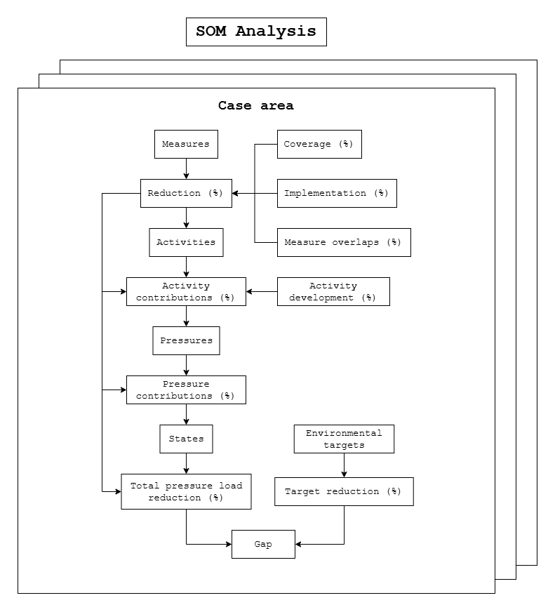

# Sufficiency of Measures

Model developed at HELCOM to assess what kind of improvements in environmental state and pressures can be achieved with existing measures [(more info)](https://helcom.fi/baltic-sea-action-plan/som/).

This project continues on the work done on the SOM model in the [HELCOM BLUES](https://github.com/helcomsecretariat/SOM/tree/main/legacy/helcom_blues) project as part of the [HELCOM PROTECT BALTIC](https://protectbaltic.eu/) project. 

## Usage & Installation

The [wiki](https://helcomsecretariat.github.io/SOM/guide/installation) contains detailed instructions on installing the tool and its requirements, as well as instructions on how to use it. 

## SOM

The scientific foundation of the SOM model framework can be found [here](https://helcom.fi/wp-content/uploads/2021/11/Methodology-for-the-sufficiency-of-measures-analysis.pdf).

### Context

The model links measures, human activities, pressures, and environmental states together to assess the improvements that can be achieved in the pressures and states through the implementation of measures. This is further compared against set thresholds to observe whether the improvements are sufficient to achieve Good Environmental Status (GES). 

### Input

Information on the input data is explained in the [wiki](https://helcomsecretariat.github.io/SOM/guide/input-data).

### Model flow

The model links together the various inputs as shown in the diagram below.

The figure above details the links between each element of the model. For each case area, a set of simulations are done. For each individual simulation run, these calculations occur:

1. An individual random sample is picked from each of the probability distributions representing the measure reductions, activity and pressure contributions, and GES thresholds.

2. Activity contributions are multiplied by their respective development factor for the chosen scenario.

3. Pressure levels are reduced by the reduction in its respective activity contributions (or directly through straight-to-pressure measures).
    - Reduction = Coverage * Implementation * Measure overlaps * Measure reduction * Activity contribution

4. Total pressure load levels on environmental states are reduced by the reduction in its respective pressure contributions (or directly through straight-to-state measures).
    - Reduction = Pressure level reduction * Pressure contribution

Once complete, the means and standard errors of the observed changes are calculated from the simulation results to assess:

- Reduction in pressure levels in each case area.
- Reduction in total pressure load on each environmental state for each case area.
- Gap to target reduction (threshold) for the total pressure load on each environmental state for each case area.

## Current codebase

#### PROTECT BALTIC (ongoing)

[Project description](https://helcom.fi/helcom-at-work/projects/protect-baltic/)  
[Code](/src)

## Past projects

#### ACTION

[Project description](https://helcom.fi/helcom-at-work/projects/action/)  
[Code](/legacy/helcom_action.zip)

#### BLUES

[Project description](https://helcom.fi/helcom-at-work/projects/blues/)  
[Code](/legacy/helcom_blues.zip)
