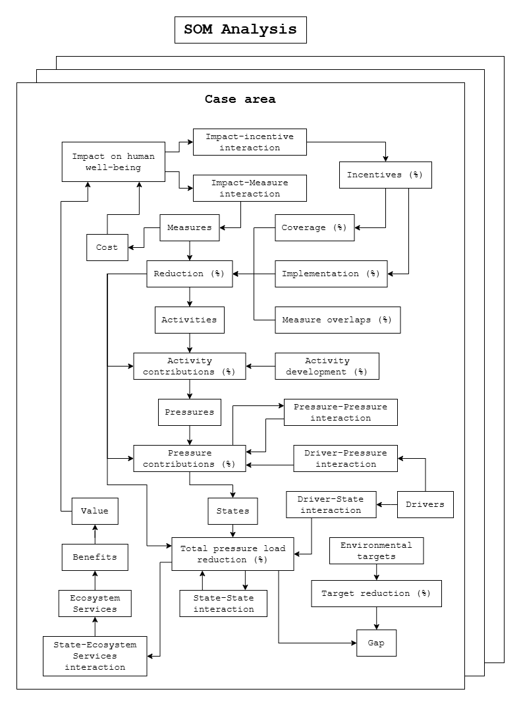

The original framework developed in the [ACTION](https://helcom.fi/helcom-at-work/projects/action/) project was further expanded on in the [BLUES](https://helcom.fi/helcom-at-work/projects/blues/) project. The figure below highlights the additions. 



Figure 1. Expanded SOM model, as developed in HELCOM BLUES.

The main components added are:

- Drivers
- Pressure-Pressure and State-State interactions
- Ecosystem services and benefits
- Impacts on human well-being
- Incentives

In order to include these in future versions of the tool, care has to be taken in order to implement them in a logical way in accordance with the already existing logic. The sections below suggest potential ways of implementing these components, given that the data on them is available. 

## Drivers

The drivers have two main vectors into the existing framework:

- Driver-Pressure interaction
- Driver-State interaction

These could be implemented as two tables, linking driver and pressure/state IDs together along with a multiplier affecting the reduction on pressure/TPL levels.

#### som_tools.py

If the data is not already as described above, add a method to handle the preprocessing of the input data:

```
def read_drivers(src):
    Arguments:
        src: source of input data
    Returns:
        driver_pressure_interactions (DataFrame): 
            driver (Any): driver ID
            pressure (Any): pressure ID
            area_id (Any): area ID, if the drivers are area specific
            multiplier (float): multiplier applied to pressure contributions
        driver_state_interaction (DataFrame):
            driver (Any): driver ID
            state (Any): state ID
            area_id (Any): area ID, if the drivers are area specific
            multiplier (float): multiplier applied to total pressure load reductions
```

#### som_app.py

Add driver-pressure interactions in `build_changes()`:

```
# after pressure reductions section, before total pressure load reductions section
for each area:
    - adjust each relevant pressure level
    - adjust pressure contributions to reflect changes
```

Add driver-state interactions in `build_changes()`:

```
# after total pressure load reductions section
for each area:
    - adjust each relevant total pressure load level
    - adjust each relevant state pressure level
```

## Pressure-Pressure and State-State interaction

The pressure-pressure and state-state interactions work similarly to the measure overlaps, represented as tables linking IDs if the same type together.

While the subpressures data reflect how a pressure makes up for a portion of another pressure, pressure-pressure interactions describe how the change in one pressure affects another pressure. 

#### som_tools.py

If the data is not already as described above, add two methods to handle the preprocessing of the input data:

```
def read_pressure_overlaps(src):
    Arguments:
        src: source of input data
    Returns:
        pressure_overlaps (DataFrame): 
            overlapping (Any): overlapping pressure ID
            overlapped (Any): overlapped pressure ID
            state (Any): state ID
            area_id (Any): area ID, if the overlaps are area specific
            multiplier (float): multiplier applied to overlapped pressure

def read_state_overlaps(src):
    Arguments:
        src: source of input data
    Returns:
        state_overlaps (DataFrame): 
            overlapping (Any): overlapping state ID
            overlapped (Any): overlapped state ID
            area_id (Any): area ID, if the overlaps are area specific
            multiplier (float): multiplier applied to overlapped state
```

#### som_app.py

Add interactions in `build_changes()`:

```
# in total pressure load reductions section, in pressure contributions sub-section, after subpressures sub-sub-section
- adjust overlapped pressure level change by relevant overlapping pressure multipliers

# after total pressure load reductions section
- adjust total pressure load level changes by relevant overlapping state multipliers
```

## Ecosystem services and benefits

The ecosystem services share similarities with the states, and could also be implemented as a table, linking the states to the ecosystem services by ID along with a multiplier to reflect the ecosystem service levels. These levels would then be affected by the total pressure load reductions accordingly.


