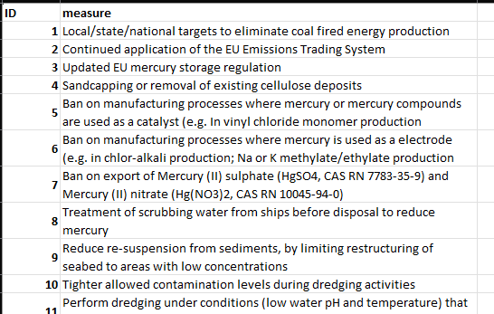
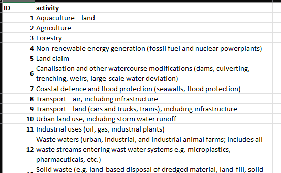
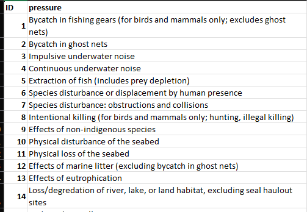
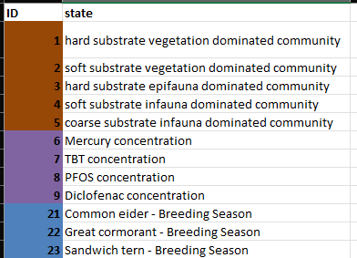
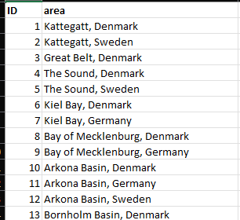
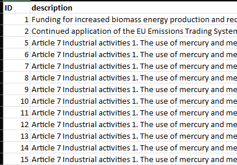
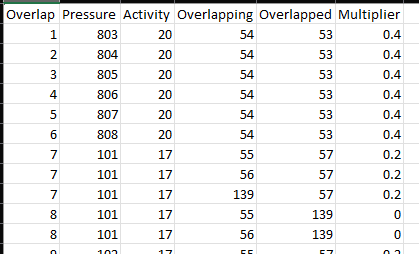
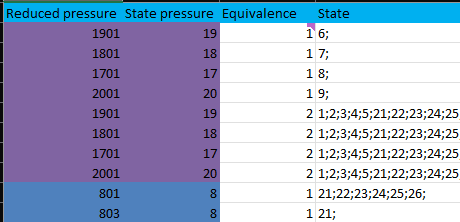
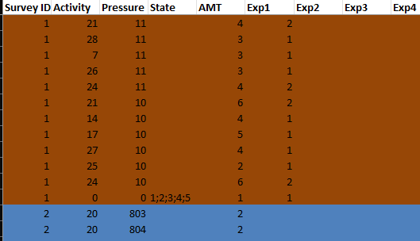

## Intro

(Note! This page details the previous format of the input data, that can be used with the SOM model by pre-processing it. To do so, make sure to set the ```use_legacy_input_data``` option to ```true``` in the configuration file)

The input data consists of three files:

- exampleData.xlsx
- exampleEffect.xlsx
- examplePressureState.xlsx

Example data has been provided in the ```data``` directory.

Please note that most column names are case sensitive.

## General Input

```exampleData.xlsx``` contains descriptions of the model domain:

#### ID sheets


#### ```sheet:Measure ID```


| Column | Type | Description |
| ------ | ---- | ----------- |
| ID | Text | Unique measure identifier |
| measure | Text | Measure description / name |

#### ```sheet:Activity ID```


| Column | Type | Description |
| ------ | ---- | ----------- |
| ID | Text | Unique activity identifier |
| activity | Text | Activity description / name |

#### ```sheet:Pressure ID```


| Column | Type | Description |
| ------ | ---- | ----------- |
| ID | Text | Unique pressure identifier |
| pressure | Text | Pressure description / name |

#### ```sheet:State ID```


| Column | Type | Description |
| ------ | ---- | ----------- |
| ID | Text | Unique state identifier |
| state | Text | State description / name |

#### ```sheet:Area ID```


| Column | Type | Description |
| ------ | ---- | ----------- |
| ID | Text | Unique area identifier |
| area | Text | Area description / name |

#### ```sheet:Case ID```


| Column | Type | Description |
| ------ | ---- | ----------- |
| ID | Text | Unique case identifier |
| case | Text | Case description / name |

#### ```sheet:ActMeas```


- Implemented measure cases, all rows are independent, multiple IDs can be joined by a semi-colon

| Column | Type | Description |
| ------ | ---- | ----------- |
| ID | Text | Case ID, linked to ```sheet:Case ID``` |
| measure | Text | Measure ID, linked to ```sheet:Measure ID``` |
| activity | Text | Relevant Activity IDs, linked to ```sheet:Activity ID```, the value 0 (zero) means all relevant activities affected by the measure |
| pressure | Text | Relevant Pressure IDs, linked to ```sheet:Pressure ID```, the value 0 (zero) means all relevant pressures affected by the measure |
| state | Text | Relevant State IDs, linked to ```sheet:State ID```, the value 0 (zero) means all relevant states affected by the measure |
| coverage | Number | Multiplier (fraction), represents how much of the area is covered by the measure |
| implementation | Number | Multiplier (fraction), represents how much of the measure is implemented |
| area_id | Text | Area ID, linked to ```sheet:Area ID``` |

#### ```sheet:ActPres```


- Activity-Pressure links, how much the individual activities contribute to the pressures

| Column | Type | Description |
| ------ | ---- | ----------- |
| Activity | Text | Activity ID, linked to ```sheet:Activity ID``` |
| Pressure | Text | Pressure ID, linked to ```sheet:Pressure ID``` |
| area_id | Text | Area ID, linked to ```sheet:Area ID```, multiple IDs can be joined by a semi-colon |
| Ml# | Number | Most likely contribution (%) |
| Min# | Number | Lowest potential contribution (%) |
| Max# | Number | Highest potential contribution (%) |

#### ```sheet:DEV_scenarios```


- Activity development scenarios

| Column | Type | Description |
| ------ | ---- | ----------- |
| Activity | Text | Activity ID, linked to ```sheet:Activity ID``` |
| ### | Number | Subsequent columns are treated as the change / scenarios (fraction) |

#### ```sheet:Overlaps```


- Interaction between separate measures, how joint implementation affects measure efficiency

| Column | Type | Description |
| ------ | ---- | ----------- |
| Overlap | Text | Overlap ID |
| Pressure | Text | Pressure ID, linked to ```sheet:Pressure ID``` |
| Activity | Text | Activity ID, linked to ```sheet:Activity ID``` |
| Overlapping | Text | Overlapping measure ID, linked to ```sheet:Measure ID``` |
| Overlapped | Text | Overlapped measure ID, linked to ```sheet:Measure ID``` |
| Multiplier | Number | Multiplier (fraction), how much of the ```column:Overlapped``` measure's effect will be observed if ```column:Overlapping``` is also implemented |

#### ```sheet:SubPres```


- Links between separate pressures, where *subpressures* make up part of *state pressures*

| Column | Type | Description |
| ------ | ---- | ----------- |
| Reduced pressure | Text | Subpressure ID, linked to ```sheet:Pressure ID``` |
| State pressure | Text | State pressure ID, linked to ```sheet:Pressure ID``` |
| Equivalence | Number | Equivalence between ```column:Reduced pressure``` and ```column:State pressure```, i.e. how much of the *state pressure* is made up of the *subpressure*, where values between 0 and 1 are treated as fractions, and other values as either no quantified equivalence or no reduction from pressures |
| State | Text | State ID, linked to ```sheet:State ID``` |

## Measure efficiencies

```exampleEffect.xslx``` contains survey data on the effects of measures on activity-pressure pairs as surved by expert panels:

#### ```sheet:MTEQ```


- General information on the survey questions, each row corresponds to a unique activity-pressure pair, the value 0 (zero) for the Activity, Pressure and State columns is used to denote no value, used for *direct to pressure* / *direct to state* measures

| Column | Type | Description |
| ------ | ---- | ----------- |
| Survey ID | Text | Survey ID, each unique id corresponds to a specific sheet in ```exampleEffect.xslx``` |
| Activity | Text | Activity ID, linked to ```exampleData.xlsx:Activity ID``` |
| Pressure | Text | Pressure ID, linked to ```exampleData.xlsx:Pressure ID``` |
| State | Text | State ID, linked to ```exampleData.xlsx:State ID``` |
| AMT | Integer | Amount of measures linked to the activity-pressure pair in the corresponding survey sheet |
| Exp# | Integer | Expert columns, details the number of experts that gave each answer, used for weighting |

#### ```sheet:Surveys```


- Survey sheets detailing the effects of the measures on the activity-pressure pairs in ```sheet:MTEQ```

| Column | Type | Description |
| ------ | ---- | ----------- |
| expert ID | Text | Expert ID, linked to the corresponding expert columns in ```sheet:MTEQ``` |
| # | Number | Measure IDs as columns, linked to ```exampleData.xlsx:Measure ID```, each measure takes two columns, where the first column describes the most likely reduction (%) of the measure on the activity-pressure pair, and the second column describes the potential uncertainty range (%) regarding the reduction |
| ME | Number | The actual effect of the most effective measure for the current activity-pressure pair |

## Pressure contributions and GES thresholds

```examplePressureState.xlsx``` contains survey data on pressure contributions to states and total pressure load reduction targets:

#### ```sheet:PSQ```


- General information on the survey questions, each row corresponds to a unique state-area pair

| Column | Type | Description |
| ------ | ---- | ----------- |
| State | Text | State ID, linked to ```exampleData.xlsx:State ID``` |
| area_id | Text | Area ID, linked to ```exampleData.xlsx:Area ID```, multiple IDs can be joined by a semi-colon |
| GES known | Integer | Is the GES threshold known, 0 for no, 1 for yes |
| Exp# | Integer | Expert columns, details the number of experts that gave each answer, used for weighting |

#### ```sheet:Surveys```


- Survey sheets detailing the contributions of individual pressures to states and the total pressure load reduction targets for the state, the targets are for PR (=GES), 10 %, 25 % and 50 % improvement in state

| Column | Type | Description |
| ------ | ---- | ----------- |
| Expert | Integer | Expert ID, linked to the corresponding expert columns in ```sheet:PSQ```, each expert's answers comprise a block of rows corresponding to the state-area pair rows in ```sheet:PSQ``` |
| P# | Text | Pressure IDs, linked to ```exampleData.xlsx:Pressure ID``` |
| S# | Text | Significance of corresponding ```column:P#```, used when weighing contributions of each pressure |
| MIN# | Number | Lowest potential threshold value (%) |
| MAX# | Number | Highest potential threshold value (%) |
| ML# | Number | Most likely threshold value (%) |
