## Intro

(Note! This page details the previous format of the input data, that can be used with the SOM model by pre-processing it. To do so, make sure to set the ```use_legacy_input_data``` option to ```true``` in the configuration file)

The input data consists of three files:

- exampleData.xlsx
- exampleEffect.xlsx
- examplePressureState.xlsx

Example data has been provided in the ```data``` directory.

Please note that most column names are case sensitive.

## General Input

```exampleData.xlsx``` contains descriptions of the model domain:

#### ID sheets


#### ```sheet:Measure ID```
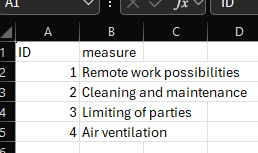

- Unique identifiers for measures

#### ```sheet:Activity ID```
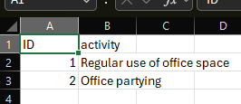

- Unique identifiers for activities

#### ```sheet:Pressure ID```
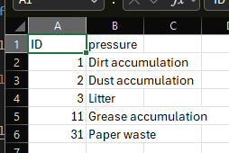

- Unique identifiers for pressures

#### ```sheet:State ID```
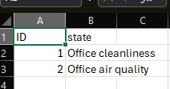

- Unique identifiers for states

#### ```sheet:Area ID```


- Unique identifiers for areas

#### ```sheet:Case ID```
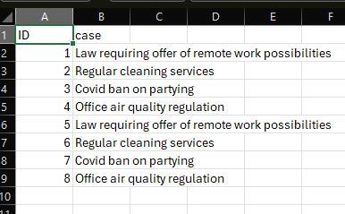

- Unique identifiers for cases

#### ```sheet:ActMeas```
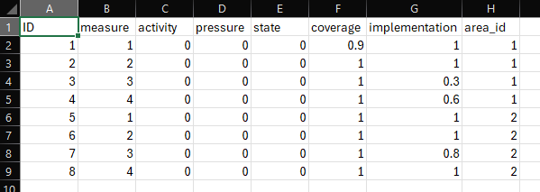

- Implemented measure cases, all rows are independent, multiple IDs can be joined by a semi-colon.
    - ```column:ID```: Unique case id, linked to ```sheet:Case ID```
    - ```column:measure```: Measure type ID, linked to ```sheet:Measure ID```
    - ```column:activity```: Relevant Activities, linked to ```sheet:Activity ID```, the value 0 (zero) means all relevant activities affected by the measure
    - ```column:pressure```: Relevant Pressures, linked to ```sheet:Pressure ID```, the value 0 (zero) means all relevant pressures affected by the measure
    - ```column:state```: Relevant States, linked to ```sheet:State ID```, the value 0 (zero) means all relevant states affected by the measure
    - ```column:coverage```: Multiplier (fraction), represents how much of the area is covered by the measure
    - ```column:implementation```: Multiplier (fraction), represents how much of the measure is implemented
    - ```column:area_id```: Area ID, linked to ```sheet:Area ID```

#### ```sheet:ActPres```


- Activity-Pressure links, how much the individual activities contribute to the pressures
    - ```column:Activity```: Activity ID, linked to ```sheet:Activity ID```
    - ```column:Pressure```: Pressure ID, linked to ```sheet:Pressure ID```
    - ```column:area_id```: Area ID, linked to ```sheet:Area ID```, multiple IDs can be joined by a semi-colon
    - ```column:Ml#```: Most likely contribution (%)
    - ```column:Min#```: Lowest potential contribution (%)
    - ```column:Max#```: Highest potential contribution (%)

#### ```sheet:DEV_scenarios```
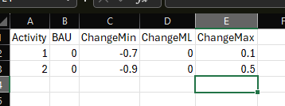

- Activity development scenarios
    - ```column:Activity```: Activity ID, linked to ```sheet:Activity ID```
    - ```column:BAU```: Business As Usual, how much the activity will change without extra action (fraction)
    - ```column:ChangeMin```: Lowest potential change (fraction)
    - ```column:ChangeML```: Most likely change (fraction)
    - ```column:ChangeMax```: Highest potential change (fraction)

#### ```sheet:Overlaps```
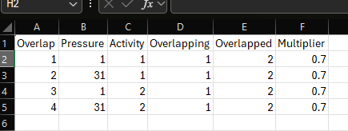

- Interaction between separate measures, how joint implementation affects measure efficiency
    - ```column:Overlap```: Overlap ID
    - ```column:Pressure```: Pressure ID, linked to ```sheet:Pressure ID```
    - ```column:Activity```: Activity ID, linked to ```sheet:Activity ID```
    - ```column:Overlapping```: Overlapping measure ID, linked to ```sheet:Measure ID```
    - ```column:Overlapped```: Overlapped measure ID, linked to ```sheet:Measure ID```
    - ```column:Multiplier```: Multiplier (fraction), how much of the ```column:Overlapped``` measure's effect will be observed if ```column:Overlapping``` is also implemented

#### ```sheet:SubPres```
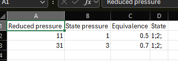

- Links between separate pressures, where *subpressures* make up part of *state pressures*
    - ```column:Reduced pressure```: Subpressure ID, linked to ```sheet:Pressure ID```
    - ```column:State pressure```: State pressure ID, linked to ```sheet:Pressure ID```
    - ```column:Equivalence```: Equivalence between ```column:Reduced pressure``` and ```column:State pressure```, i.e. how much of the *state pressure* is made up of the *subpressure*, where values between 0 and 1 are treated as fractions, and other values as either no quantified equivalence or no reduction from pressures
    - ```column:State```: State ID, linked to ```sheet:State ID```

## Measure efficiencies

```exampleEffect.xslx``` contains survey data on the effects of measures on activity-pressure pairs as surved by expert panels:

#### ```sheet:MTEQ```
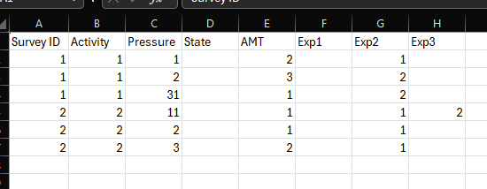

- General information on the survey questions, each row corresponds to a unique activity-pressure pair, the value 0 (zero) for the Activity, Pressure and State columns is used to denote no value, used for *direct to pressure* / *direct to state* measures
    - ```column:Survey ID```: Survey ID, each unique id corresponds to a specific sheet in ```exampleEffect.xslx```
    - ```column:Activity```: Activity ID, linked to ```exampleData.xlsx:Activity ID```
    - ```column:Pressure```: Pressure ID, linked to ```exampleData.xlsx:Pressure ID```
    - ```column:State```: State ID, linked to ```exampleData.xlsx:State ID```
    - ```column:AMT```: Amount of measures linked to the activity-pressure pair in the corresponding survey sheet
    - ```column:Exp#```: Expert columns, details the number of experts that gave each answer, used for weighting

#### ```sheet:Surveys```


- Survey sheets detailing the effects of the measures on the activity-pressure pairs in ```sheet:MTEQ```
    - ```column:expert ID```: Expert ID, linked to the corresponding expert columns in ```sheet:MTEQ```
    - ```column:#```: Measure IDs as columns, linked to ```exampleData.xlsx:Measure ID```, each measure takes two columns
        - the first column describes the most likely reduction (%) of the measure on the activity-pressure pair
        - the second column describes the potential uncertainty range (%) regarding the reduction
    - ```column:ME```: The actual effect of the most effective measure for the current activity-pressure pair

## Pressure contributions and GES thresholds

```examplePressureState.xlsx``` contains survey data on pressure contributions to states and total pressure load reduction targets:

#### ```sheet:PSQ```
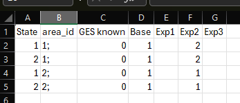

- General information on the survey questions, each row corresponds to a unique state-area pair
    - ```column:State```: State ID, linked to ```exampleData.xlsx:State ID```
    - ```column:area_id```: Area ID, linked to ```exampleData.xlsx:Area ID```, multiple IDs can be joined by a semi-colon
    - ```column:GES known```: Is the GES threshold known, 0 for no, 1 for yes
    - ```column:Exp#```: Expert columns, details the number of experts that gave each answer, used for weighting

#### ```sheet:Surveys```


- Survey sheets detailing the contributions of individual pressures to states and the total pressure load reduction targets for the state, the targets are for PR (=GES), 10 %, 25 % and 50 % improvement in state
    - ```column:Expert```: Expert ID, linked to the corresponding expert columns in ```sheet:PSQ```, each expert's answers comprise a block of rows corresponding to the state-area pair rows in ```sheet:PSQ```
    - ```column:P#```: Pressure IDs, linked to ```exampleData.xlsx:Pressure ID```
    - ```column:S#```: Significance of corresponding ```column:P#```, used when weighing contributions of each pressure
    - ```column:MIN#```: Lowest potential threshold value (%)
    - ```column:MAX#```: Highest potential threshold value (%)
    - ```column:ML#```: Most likely threshold value (%)